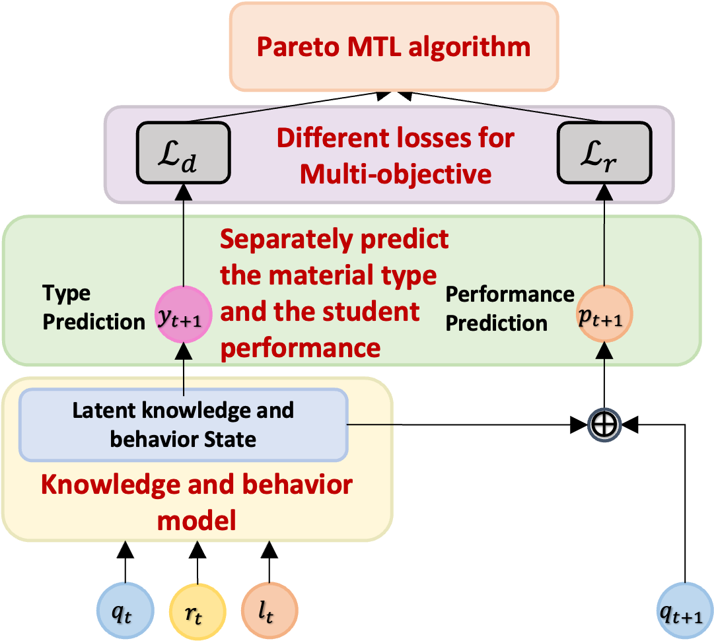

# Towards Multi-Objective Behavior and Knowledge Modeling in Students (Pareto-GMKT & Pareto-TAMKOT)
Code for our paper:

 S. Zhao, and S. Sahebi. Towards Multi-Objective Behavior and Knowledge Modeling in Students. In Adjunct Proceedings of the 32nd ACM Conference on User Modeling, Adaptation and Personalization (UMAP Adjunct ’24).

If you have any questions, please email szhao2@albany.edu

## Pareto Knowledge and Bhavior Modeling Framework:




## Prerequisit
```angular2html
numpy
torch
scipy
sklearn
pickle
more_itertools
easydict
matplotlib
```

### How to install and run

```angular2html
git clone https://github.com/persai-lab/2024-UMAP-Pareto-GMKT-Pareto-TAMKOT
cd 2024-UMAP-Pareto-GMKT-Pareto-TAMKOT
conda env create -f environment.yml
source init_env.sh
python run.py
```


## Cite:

Please cite our paper if you use this code in your own work:

```
@inproceedings{zhao2024towards,
  title={Towards Multi-Objective Behavior and Knowledge Modeling in Students},
  author={Zhao, Siqian and Sahebi, Shaghayegh},
  booktitle={Adjunct Proceedings of the 32nd ACM Conference on User Modeling, Adaptation and Personalization (UMAP Adjunct '24)},
  pages={183--188},
  year={2024}
}
```

## Collarators:
```angular2html
Siqian Zhao: szhao2@albany.edu
Sherry Sahebi: ssahebi@albany.edu
```

## Acknowledgement:

This paper is based upon work supported by the National Science Foundation under Grant No. 2047500.